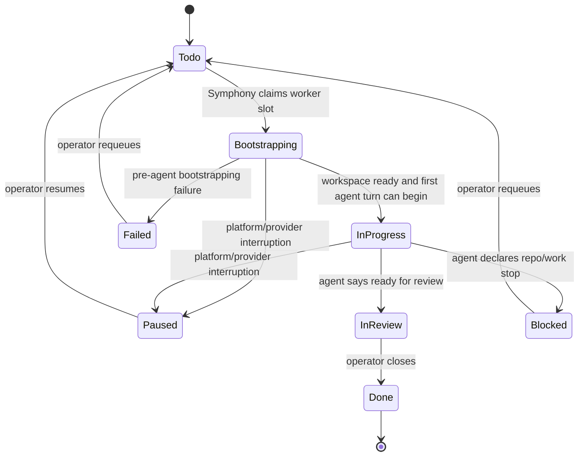

# Durable Issue Workspace State Machine

Date: 2026-04-03

## Purpose

Define the intended Symphony execution model for durable issue workspaces, explicit orchestration
states, and operator-controlled recovery.

This document captures the product decisions for how Symphony should behave when a ticket is
dispatched, paused, blocked, failed, reviewed, and completed.

## Core Invariants

- The durable unit of work is the issue.
- An issue workspace is provisioned once and reused across runs.
- Symphony must not implicitly reset, re-clone, or destroy an issue workspace after initial
  provisioning succeeds.
- State changes must not secretly destroy workspace state.
- Only an explicit future reset action may destroy and recreate an issue workspace.
- The issue workspace includes repo state, unstaged changes, staged changes, local commits,
  issue-branch history, and durable service data.
- Provider/platform interruptions are explicit hard stops. There are no hidden retries.
- `Paused` is platform-owned only.
- `Blocked` is agent/repo-owned only.
- `Failed` is a hard stop for pre-agent bootstrapping failures.
- `In Review` is a hard stop for operator review.
- `Done` is operator-owned and triggers eager teardown only after final artifact capture.

## Workspace Model

- Each issue gets a stable deterministic workspace identity and host path.
- Each issue workspace is pinned to a canonical issue branch created during initial provisioning.
- Issue branch naming stays on the current `symphony/<issue>` convention.
- The branch that issue work starts from is repo-configurable and should live in the admitted repo
  contract, not machine-local config.
- A future repo contract field should declare the initial base branch, for example
  `workspace.baseBranch`.
- If no base branch is configured, Symphony should default to the repo's remote default branch.
- The agent is allowed to create additional branches, rewrite git history, edit remotes, and
  otherwise act freely inside the issue container.
- Symphony should not force checkout of the canonical issue branch on later runs.

## Persistence Rules

### Survives Across Runs

- filesystem state
- unstaged and staged changes
- local commits
- issue branch state
- durable service data

### Does Not Stay Hot By Default

- active workspace container
- active service containers

When an issue enters `Paused`, hot compute can stop, but the issue workspace and durable service
data remain available for later reattachment.

## State Machine

## Linear States

### Dispatch States

- `Todo`
- `Bootstrapping`
- `In Progress`
- `Approved`

`Approved` remains merge-only and is not a general implementation state.

### Non-Dispatch States

- `In Review`
- `Blocked`
- `Paused`
- `Failed`

### Terminal States

- `Done`
- `Canceled`

## State Semantics

### `Todo`

- Dispatchable queue state.
- No setup or hidden work should happen while the ticket remains in `Todo`.

### `Bootstrapping`

- Platform-owned preparation state.
- Counts against concurrency limits.
- Entered only when a real worker slot is available.
- Covers workspace attach/provision, branch creation, preflight, and pre-agent setup.
- A ticket leaves `Bootstrapping` only when the first real Codex turn can begin.

### `In Progress`

- Agent is actively working.
- This begins at the first Codex turn start, not at workspace creation.

### `In Review`

- Agent says work is ready for operator review.
- Hard no-dispatch state.
- Agent may move `In Progress -> In Review`.
- Operator decides what happens next.

### `Blocked`

- Agent/repo-owned stop after work has begun.
- Hard no-dispatch state.
- No hidden retries.
- Workspace is preserved by default.

### `Paused`

- Platform/provider-owned stop.
- Hard no-dispatch state.
- No hidden retries.
- Workspace is preserved by default.
- Only the Symphony platform may move a ticket into `Paused`.
- Only the operator may move a ticket out of `Paused`.

### `Failed`

- Hard no-dispatch state for failures before the agent begins real work.
- Workspace is preserved by default.
- Requeueing from `Failed -> Todo` reruns `Bootstrapping` in the same workspace by default.

### `Done`

- Operator-owned completion state.
- Agent must not move tickets to `Done`.
- Eager teardown happens immediately after final artifact capture.

## Ownership Boundaries

### Symphony Platform May Move

- `Todo -> Bootstrapping`
- `Bootstrapping -> In Progress`
- `Bootstrapping -> Failed`
- `Bootstrapping -> Paused`
- `In Progress -> Paused`

### Agent May Move

- `In Progress -> Blocked`
- `In Progress -> In Review`

### Operator May Move

- `Paused -> Todo`
- `Failed -> Todo`
- `Blocked -> Todo`
- `In Review -> Done`
- any move to `Canceled`
- direct manual close decisions when needed

## Failure Buckets

The platform should preserve a machine-readable reason bucket and subreason even when multiple
cases land in the same Linear state.

Examples:

- `platform_preflight_failed`
- `workspace_provision_failed`
- `repo_bootstrap_failed`
- `repo_migrate_failed`
- `provider_capacity_paused`
- `provider_transport_paused`

## Comments

Comments are mandatory now for:

- move to `Paused`
- move to `Failed`
- resume from `Paused -> Todo`

Comments should use a fixed structure:

- state transition
- reason bucket
- short human-readable message
- whether workspace was preserved
- next operator action

`Done` remains comment-free for now because completion is operator-owned.

## Mandatory Artifacts

### Run Start

- issue id
- run id
- workspace id
- workspace host path
- workspace created vs reused
- current branch
- HEAD SHA if present
- git status summary
- remotes
- active container and service identities

### Move To `Paused`

- reason bucket
- raw error/message
- current branch
- HEAD SHA if present
- dirty/staged summary
- whether workspace was preserved
- whether hot compute was stopped
- next operator action

### Move To `Blocked`

- blocker reason
- failure details
- current branch
- HEAD SHA if present
- dirty/staged summary
- suggested next action

### Move To `In Review`

- current branch
- HEAD SHA if present
- changed files
- commit summary if commits exist
- verification summary if available
- short agent completion statement

### Before `Done`

- final artifact capture must complete before teardown
- richer `Done` artifact capture can be expanded later

## Dispatch Rules

- `Paused` must stop polling and retrying for that issue.
- `Failed` must stop polling and retrying for that issue.
- `Blocked` must stop polling and retrying for that issue.
- `In Review` must stop polling and retrying for that issue.
- `Paused -> Todo` is the only normal resume path from `Paused`.
- `Paused -> In Progress` should not be treated as a normal path.
- `Failed -> Todo` reruns `Bootstrapping` in the same workspace by default.
- `Blocked -> Todo` preserves the workspace by default.

## Teardown Rules

- `Done` tears down immediately after final artifact capture.
- `Canceled` tears down immediately after final artifact capture.
- `Paused`, `Failed`, and `Blocked` preserve the workspace by default.
- The platform must not preserve failed bootstrapping workspaces forever; explicit cleanup tooling
  should follow after the golden path is stable.

## Deferred Work

- explicit `Reset Workspace` operator action
- repo-configurable `workspace.baseBranch` in the runtime contract
- deeper dashboard controls and filters for reason buckets
- richer `Done` artifact capture
- continuity brief injection on new-thread resume
- remote drift surfacing
- meaningful progress metrics
- typed normalization of Codex event payloads, tool calls, approvals, and file-change artifacts
- evaluation of the Codex TypeScript SDK as a simpler typed integration path if it preserves the
  fully autonomous runtime model

## Non-Goals For This Wave

- provider/model routing changes
- OpenRouter integration
- broad guardrail policy inside the issue container
- complex retry heuristics
- hidden workspace refresh behavior
